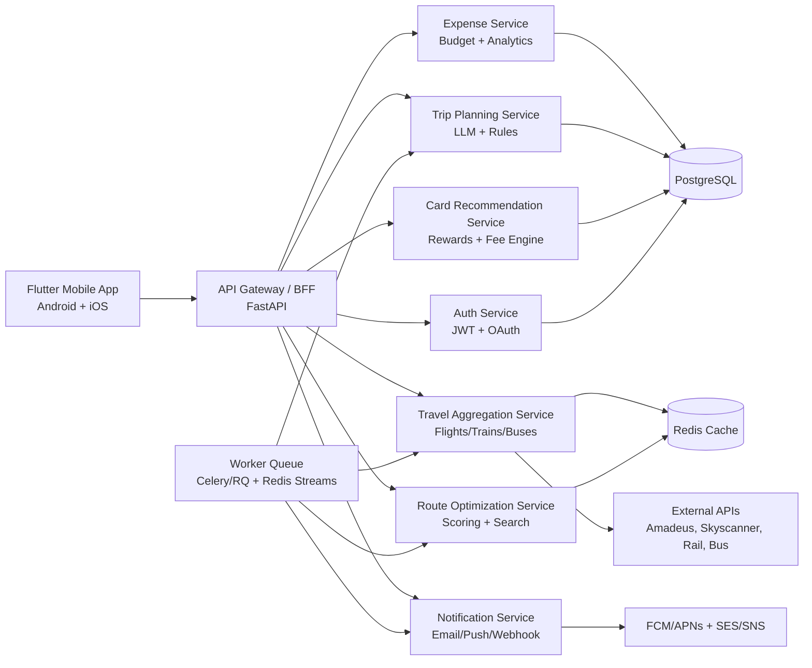

# AI Travel Planner + Cheapest Route Finder + Expenditure Guide

## 1) Complete System Architecture Diagram

### High-level architecture (microservice-ready)



### Runtime request flow (cheapest-route lookup)

```mermaid
sequenceDiagram
    participant App as Flutter App
    participant BFF as FastAPI Gateway
    participant Agg as Aggregation Service
    participant Cache as Redis
    participant Opt as Optimization Service
    participant API as External Provider APIs

    App->>BFF: Search trip query
    BFF->>Cache: Query key(route/date/flex)
    alt Cache hit
      Cache-->>BFF: Aggregated offers
    else Cache miss
      BFF->>Agg: Fetch provider offers
      Agg->>API: Parallel async provider calls
      API-->>Agg: Offers raw data
      Agg-->>Cache: Store normalized offers (TTL)
      Agg-->>BFF: Normalized offers
    end
    BFF->>Opt: Rank and optimize routes
    Opt-->>BFF: Cheapest + best value + fastest
    BFF-->>App: Results + alternatives + confidence
```

## 2) Database Schema (PostgreSQL + Redis)

### Core relational schema (PostgreSQL)

```sql
-- users and auth
CREATE TABLE users (
  id UUID PRIMARY KEY,
  email TEXT UNIQUE NOT NULL,
  full_name TEXT,
  home_currency CHAR(3) DEFAULT 'USD',
  locale TEXT DEFAULT 'en-US',
  created_at TIMESTAMPTZ DEFAULT now(),
  updated_at TIMESTAMPTZ DEFAULT now()
);

CREATE TABLE user_preferences (
  user_id UUID PRIMARY KEY REFERENCES users(id) ON DELETE CASCADE,
  seat_class TEXT,
  preferred_airlines TEXT[],
  price_alert_enabled BOOLEAN DEFAULT TRUE,
  loyalty_programs JSONB,
  card_portfolio JSONB,
  updated_at TIMESTAMPTZ DEFAULT now()
);

-- search + offers
CREATE TABLE trip_searches (
  id UUID PRIMARY KEY,
  user_id UUID REFERENCES users(id),
  origin_code TEXT NOT NULL,
  destination_code TEXT NOT NULL,
  trip_type TEXT NOT NULL, -- one_way, round_trip, multi_city
  depart_date DATE NOT NULL,
  return_date DATE,
  adults INT DEFAULT 1,
  children INT DEFAULT 0,
  cabin_class TEXT,
  constraints JSONB,
  created_at TIMESTAMPTZ DEFAULT now()
);

CREATE TABLE provider_offers (
  id UUID PRIMARY KEY,
  search_id UUID REFERENCES trip_searches(id) ON DELETE CASCADE,
  provider TEXT NOT NULL,
  transport_mode TEXT NOT NULL, -- flight/train/bus
  route_json JSONB NOT NULL,
  base_fare NUMERIC(12,2) NOT NULL,
  taxes NUMERIC(12,2) DEFAULT 0,
  total_fare NUMERIC(12,2) NOT NULL,
  currency CHAR(3) NOT NULL,
  duration_minutes INT,
  layovers INT DEFAULT 0,
  refundable BOOLEAN,
  baggage_json JSONB,
  deep_link TEXT,
  fetched_at TIMESTAMPTZ DEFAULT now(),
  expires_at TIMESTAMPTZ
);

CREATE TABLE ranked_routes (
  id UUID PRIMARY KEY,
  search_id UUID REFERENCES trip_searches(id) ON DELETE CASCADE,
  offer_id UUID REFERENCES provider_offers(id),
  score_total NUMERIC(8,4) NOT NULL,
  score_price NUMERIC(8,4) NOT NULL,
  score_duration NUMERIC(8,4) NOT NULL,
  score_convenience NUMERIC(8,4) NOT NULL,
  is_cheapest BOOLEAN DEFAULT FALSE,
  is_fastest BOOLEAN DEFAULT FALSE,
  is_best_value BOOLEAN DEFAULT FALSE,
  rank_position INT NOT NULL,
  created_at TIMESTAMPTZ DEFAULT now()
);

-- price tracking and alerts
CREATE TABLE price_snapshots (
  id UUID PRIMARY KEY,
  route_hash TEXT NOT NULL,
  provider TEXT NOT NULL,
  total_fare NUMERIC(12,2) NOT NULL,
  currency CHAR(3) NOT NULL,
  captured_at TIMESTAMPTZ DEFAULT now()
);

CREATE INDEX idx_price_snapshots_route_time ON price_snapshots(route_hash, captured_at DESC);

CREATE TABLE price_alerts (
  id UUID PRIMARY KEY,
  user_id UUID REFERENCES users(id) ON DELETE CASCADE,
  route_hash TEXT NOT NULL,
  target_price NUMERIC(12,2),
  threshold_pct NUMERIC(5,2),
  is_active BOOLEAN DEFAULT TRUE,
  created_at TIMESTAMPTZ DEFAULT now(),
  triggered_at TIMESTAMPTZ
);

-- planner + itinerary
CREATE TABLE itineraries (
  id UUID PRIMARY KEY,
  user_id UUID REFERENCES users(id) ON DELETE CASCADE,
  destination_city TEXT NOT NULL,
  start_date DATE NOT NULL,
  end_date DATE NOT NULL,
  budget_total NUMERIC(12,2),
  currency CHAR(3),
  ai_model TEXT,
  itinerary_json JSONB NOT NULL,
  created_at TIMESTAMPTZ DEFAULT now(),
  updated_at TIMESTAMPTZ DEFAULT now()
);

CREATE TABLE itinerary_items (
  id UUID PRIMARY KEY,
  itinerary_id UUID REFERENCES itineraries(id) ON DELETE CASCADE,
  day_no INT NOT NULL,
  item_type TEXT NOT NULL, -- attraction/food/transport/hotel
  title TEXT NOT NULL,
  start_time TIMESTAMPTZ,
  end_time TIMESTAMPTZ,
  estimated_cost NUMERIC(12,2),
  notes TEXT,
  metadata JSONB
);

-- expenses and budget
CREATE TABLE trips (
  id UUID PRIMARY KEY,
  user_id UUID REFERENCES users(id) ON DELETE CASCADE,
  name TEXT,
  start_date DATE,
  end_date DATE,
  budget_total NUMERIC(12,2),
  currency CHAR(3),
  created_at TIMESTAMPTZ DEFAULT now()
);

CREATE TABLE expenses (
  id UUID PRIMARY KEY,
  trip_id UUID REFERENCES trips(id) ON DELETE CASCADE,
  user_id UUID REFERENCES users(id) ON DELETE CASCADE,
  category TEXT NOT NULL, -- food/stay/transport/activities/other
  amount NUMERIC(12,2) NOT NULL,
  currency CHAR(3) NOT NULL,
  amount_home NUMERIC(12,2),
  merchant TEXT,
  note TEXT,
  spent_at TIMESTAMPTZ NOT NULL,
  created_at TIMESTAMPTZ DEFAULT now()
);

CREATE INDEX idx_expenses_trip_time ON expenses(trip_id, spent_at DESC);

-- credit card recommendation
CREATE TABLE credit_cards (
  id UUID PRIMARY KEY,
  issuer TEXT NOT NULL,
  card_name TEXT NOT NULL,
  network TEXT,
  annual_fee NUMERIC(12,2),
  forex_markup_pct NUMERIC(5,2),
  cashback_rules JSONB,
  miles_rules JSONB,
  lounge_access_json JSONB,
  reward_valuation_json JSONB,
  eligibility_rules JSONB,
  updated_at TIMESTAMPTZ DEFAULT now()
);

CREATE TABLE card_recommendations (
  id UUID PRIMARY KEY,
  user_id UUID REFERENCES users(id) ON DELETE CASCADE,
  trip_id UUID REFERENCES trips(id) ON DELETE CASCADE,
  card_id UUID REFERENCES credit_cards(id),
  projected_spend NUMERIC(12,2),
  projected_rewards_value NUMERIC(12,2),
  projected_forex_cost NUMERIC(12,2),
  net_savings NUMERIC(12,2),
  score NUMERIC(8,4),
  rationale JSONB,
  created_at TIMESTAMPTZ DEFAULT now()
);
```

### Redis structures

- `offer_cache:{origin}:{dest}:{date}:{pax}:{cabin}` -> normalized offer list JSON (TTL 5-20 min)
- `price_series:{route_hash}` -> sorted set(timestamp, price)
- `lock:provider:{search_id}` -> short lock for duplicate API calls
- `queue:alerts` -> notification jobs
- `queue:price_refresh` -> scheduled tracking jobs

## 3) Backend API Structure (FastAPI)

### Service boundaries

- **API Gateway/BFF**: request orchestration, auth, pagination, response shaping.
- **Aggregation Service**: provider adapters, normalization, retry/backoff.
- **Route Service**: scoring/ranking, alternative airports and date flexibility.
- **Planner Service**: LLM itinerary generation + deterministic budget rules.
- **Cards Service**: reward simulation and effective savings.
- **Expense Service**: spend tracking, analytics, budget prediction.
- **Notification Service**: price-drop alerts and reminders.

### Example API endpoints

```http
POST   /v1/auth/register
POST   /v1/auth/login
GET    /v1/users/me
PATCH  /v1/users/me/preferences

POST   /v1/searches
GET    /v1/searches/{search_id}
GET    /v1/searches/{search_id}/offers
GET    /v1/searches/{search_id}/ranked-routes
POST   /v1/searches/{search_id}/alerts

GET    /v1/routes/optimize
POST   /v1/routes/multi-city/optimize
GET    /v1/routes/price-prediction
GET    /v1/routes/departure-time-recommendations

POST   /v1/itineraries/generate
GET    /v1/itineraries/{itinerary_id}
PATCH  /v1/itineraries/{itinerary_id}
POST   /v1/itineraries/{itinerary_id}/checklist

POST   /v1/cards/recommend
GET    /v1/cards
GET    /v1/cards/{card_id}

POST   /v1/trips
GET    /v1/trips/{trip_id}
POST   /v1/trips/{trip_id}/expenses
GET    /v1/trips/{trip_id}/expenses
GET    /v1/trips/{trip_id}/analytics
GET    /v1/trips/{trip_id}/budget-forecast

POST   /v1/notifications/test
POST   /v1/webhooks/providers/{provider}
```

### Async architecture and workers

- FastAPI handles low-latency APIs.
- Celery/RQ workers run:
  - periodic price refresh jobs,
  - historical aggregation for predictions,
  - push/email notifications,
  - LLM itinerary regeneration with retries.

## 4) Route Optimization Algorithm Logic

### Inputs

- normalized offers from all providers
- user constraints (budget, max duration, max layovers, preferred departure windows)
- contextual signals (weekday seasonality, airport alternatives, reliability score)

### Processing steps

1. **Normalize** offers to a canonical format (currency converted to user home currency).
2. **Filter hard constraints** (visa constraints if available, max stops, excluded providers).
3. **Expand alternatives**:
   - nearby departure/arrival airports (radius rule + ground transfer penalty),
   - ±3 day flex window,
   - multi-modal combinations if valid.
4. **Compute scores** per candidate:

   \[
   score = w_p * price\_score + w_d * duration\_score + w_l * layover\_score + w_r * reliability\_score + w_t * departure\_time\_score
   \]

5. **Pareto frontier pass** for price vs duration to avoid dominated options.
6. **Label** cheapest, fastest, best-value.
7. **Explainability payload** returned to client (why ranked #1).

### Pseudocode

```python
def rank_routes(offers, user_pref, context):
    normalized = [normalize(o, user_pref.home_currency) for o in offers]
    feasible = [o for o in normalized if passes_constraints(o, user_pref)]
    expanded = expand_flexible_dates_and_airports(feasible, context)

    scored = []
    for o in expanded:
      price_s = inverse_minmax(o.total_fare, expanded, cap=0.4)
      duration_s = inverse_minmax(o.duration_minutes, expanded, cap=0.25)
      layover_s = inverse_minmax(o.layovers, expanded, cap=0.15)
      reliability_s = provider_reliability(o.provider, context) * 0.10
      dep_time_s = departure_time_fit(o, user_pref) * 0.10

      total = price_s + duration_s + layover_s + reliability_s + dep_time_s
      scored.append((o, total))

    pareto = non_dominated_filter(scored, keys=["total_fare", "duration_minutes"])
    ranked = sorted(pareto, key=lambda x: x[1], reverse=True)
    return add_labels_and_explanations(ranked)
```

### Price prediction

- Start with baseline: Prophet/XGBoost on route-level historical daily fares.
- Features: day-of-week, seasonality, days-to-departure, event calendar signal, provider spread.
- Output: expected price band + confidence + “buy now / wait” suggestion.

## 5) Credit Card Scoring Model

### Effective savings formula

For a trip spend profile `S`:

- `forex_cost = intl_spend * forex_markup_pct`
- `cashback_value = sum(category_spend * cashback_rate(category))`
- `miles_value = earned_miles * miles_value_per_point`
- `lounge_value = min(expected_visits, free_visits) * value_per_visit`
- `net_value = cashback_value + miles_value + lounge_value - forex_cost - prorated_annual_fee`

Final normalized score:

\[
card\_score = 0.40 * net\_value\_norm + 0.20 * rewards\_fit + 0.15 * forex\_advantage + 0.15 * acceptance\_score + 0.10 * perks\_fit
\]

### Recommendation output

- Top 3 cards with:
  - projected net savings,
  - break-even spend,
  - reward type split (cashback vs miles),
  - confidence and assumptions.

## 6) MVP Development Roadmap (90 days)

### Phase 1 (Day 1-30): Foundation + Core Search

- Product & data contracts finalized (OpenAPI + event schemas).
- Set up monorepo structure:
  - `mobile/flutter_app`
  - `backend/services/*`
  - `infra/terraform`
- Implement auth, user profile, preferences.
- Build aggregation adapters for 1 flight API + 1 bus/train source.
- Implement route normalization + cheapest/fastest ranking.
- Flutter screens: onboarding, search form, results list.

**Milestone:** user can search and compare routes for one-way + round-trip.

### Phase 2 (Day 31-60): Planner + Card Engine + Alerts

- LLM itinerary generator with structured JSON output.
- Expense module (manual entry + categories + dashboard basics).
- Credit card recommendation engine (rule-based v1).
- Price tracking jobs + alert subscriptions.
- Notification integrations (push + email).

**Milestone:** user can generate itinerary, track budget, and receive price-drop alerts.

### Phase 3 (Day 61-90): Optimization + Hardening + Launch

- Multi-city optimization and flexible-date alternatives.
- Price prediction model (v1) and departure-time recommendation.
- Analytics and forecast for remaining budget.
- QA automation, load tests, observability dashboards.
- Security hardening (rate limits, secret rotation, OWASP checks).
- Beta rollout and feedback loop.

**Milestone:** production-ready MVP with monitoring and CI/CD.

## 7) Deployment Strategy (AWS + Vercel-compatible)

### Recommended split

- **Flutter app**: distributed via Play Store/App Store.
- **Backend APIs**: AWS ECS Fargate (or EKS when scale requires).
- **PostgreSQL**: AWS RDS (Multi-AZ).
- **Redis**: AWS ElastiCache Redis.
- **Async workers**: ECS services with autoscaling.
- **Object storage/log export**: S3.
- **Notifications**: SNS/SES + Firebase/APNs.
- **CDN/WAF**: CloudFront + AWS WAF.
- **Secrets**: AWS Secrets Manager.
- **Observability**: CloudWatch + OpenTelemetry + Grafana.

### CI/CD

- GitHub Actions:
  - lint/test/build per service,
  - container scan,
  - push images to ECR,
  - deploy via Terraform + rolling updates.
- Environment tiers: `dev -> staging -> prod` with feature flags.

### Vercel usage

- If you need a lightweight public web companion (landing page/admin-lite), deploy Next.js front-end on Vercel.
- Keep API and stateful workloads on AWS; Vercel can call API Gateway endpoints.

### NFR targets

- API p95 latency < 400 ms for cached search results.
- Provider fan-out timeout budget: 3-8s with partial result fallback.
- SLO: 99.9% availability for search and alerts.
- GDPR-ready data retention and deletion workflows.
